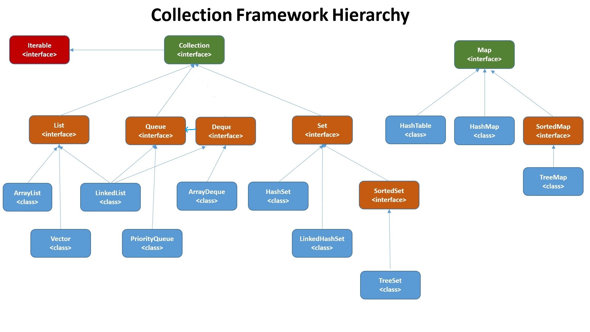

# Java Collections Framework

### Collection

- "Collection" is an interface in which most java data structures inherit from
- Collection provides:
  - size()
  - add(Object o)
  - containsAll(Collection<? extends E> c)
  - remove(Object o)
  - isEmpty()
  - contains(Object o)
  - containsAll(Collection<?> c)
  - iterator()
- Collection is actually a sub-interface of Iterable, so it provides its implementing classes with the methods from Iterable as well
  - forEach(Consumer action)
  - iterator() returns an Iterator (also an interface)
    - Iterator hasNext(), next(), and remove() to iterate over and manipulate Collections
    - good for removing elements and for moving over two collections simultaneously
- the iterable interface is what allows us to use a for-each on a collection
  - any object that implements iterable will allow us to use a dynamic for loop to iterate through it
  - array are an exception to this, as we can use a for each loop with arrays despite them not implementing the iterable interface
- inheriting from Collection we have sub-interfaces: Set, List, and Queue

#### Collections vs Collection

- Collection represents the interface that defines methods that most of the classes in the Collection Framework share
- [Collections](https://docs.oracle.com/javase/8/docs/api/java/util/Collections.html) is a utility class which contains helpful methods for working with java collections

### List

- contains additional methods for index based operations
  - positional access using methods such as get, set, add, addAll, and remove
  - positional searching methods such as indexOf and lastIndexOf
- can contain duplicate elements

### Set

- only supports unique values; if o1.equals(o2), o1 and o2 cannot both be in the set
- otherwise, the set interface contains no additional methods

### Queue

- used to store data in a particular processing order, traditionally FIFO (first in first out)
- includes additional methods for processing data, such as offer, poll and peek

### Map

- used to store key value pairs
- is not in the same inheritance hierarchy as the Iterable and Collection interface
- because of this, Maps are not directly iterable
- some methods include containsKey(Object o), containsValue(Object o), get(Object key), put(K key, V, value), remove(key), keySet(), values()

## Some Concrete Implementations of Collections

### 1. ArrayList

- linear, array backed data structure
  
  

(images from beginnersbook)

---

### 2. LinkedList

- linear data structure using a node based architecture
- element data is stored in a node which has a reference pointing to the next node, and also to the previous node if its a doubly linked list
  
  

(images from java2novice)

---

### 3. PriorityQueue

- ordered according to their [natural ordering](https://docs.oracle.com/javase/8/docs/api/java/lang/Comparable.html), or by a [Comparator](https://docs.oracle.com/javase/8/docs/api/java/util/Comparator.html) provided at queue construction time

---

### 4. ArrayDeque
- an array backed double ended queue, can be used like an stack (LIFO) or a queue (FIFO)

(image from geeksforgeeks)

---

### 5. HashMap

- map entries are placed into buckets based on an algorithm using the hashcode of the key
  

(image from Tech Master Tutorials)

---

### 6. TreeMap

- based on a binary tree structure, ordered using [natural ordering](https://docs.oracle.com/javase/8/docs/api/java/lang/Comparable.html), or by a [Comparator](https://docs.oracle.com/javase/8/docs/api/java/util/Comparator.html) provided at construction time

#### Binary Tree
  

#### Tree Map 
  

(images from geeksforgeeks)

---

### 7. HashSet

- utilizes a hashmap, and puts a dummy variable in place of the value in the key value pair

---

### 8. TreeSet

- utilizes a treemap, and puts a dummy variable in place of the value in the key value pair

## Comparison 

We have two means of comparing objects in Java. 

We can define a natural ordering for an object, by having its class implement the [Comparable interface](https://docs.oracle.com/javase/8/docs/api/java/lang/Comparable.html). Natural ordering is an order that is intrinsic to a particular type, it is tied to the object itself. Numbers and letters already have a natural ordering (1,2,3,... a,b,c...). The Comparable interface allows us to apply this natural ordering to other objects. 

We are also able to define an ordering that is not intrinsically tied to the object itself. Using the [Comparator interface](https://docs.oracle.com/javase/8/docs/api/java/util/Comparator.html), we are able to define an independent object which contains the information to compare two objects. The Comparator interface also allows us to define multiple means of comparing objects.